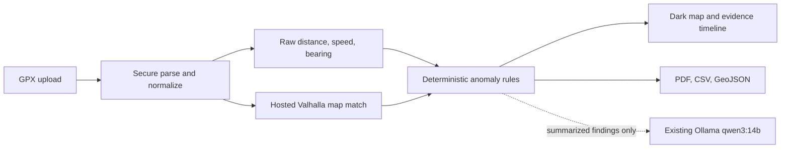

# GPX Inspector

GPX Inspector is a dark-themed local web application for inspecting recorded movement against OpenStreetMap-derived road data. It calculates raw track metrics, requests map matching from Valhalla, flags deterministic anomalies, and exports PDF, CSV, and GeoJSON reports.


## Start

Requirements: Docker Desktop with Compose and, for optional explanations, an already installed Ollama containing `qwen3:14b`.

```powershell
docker compose up --build
```

All services use Docker's `unless-stopped` restart policy. They restart after a
container failure or Docker Desktop restart, unless you explicitly stop them.
Enable **Start Docker Desktop when you sign in** in Docker Desktop settings if
the stack should return automatically after rebooting Windows.

Open <http://localhost:3010>. The API documentation is at <http://localhost:8010/docs>.

No `.env` file is required. Copy `.env.example` to `.env` only to override defaults. The app never installs Ollama or downloads a model. From Docker it connects to the host service at `http://host.docker.internal:11434/v1` and enables explanations only when the exact `qwen3:14b` tag is returned by `/v1/models`.

## Analysis pipeline



Current detectors cover implausible speed, sudden acceleration/braking, sudden heading changes, mapped speed-limit exceedance, and road offset when provider attribution is available. The API data model also preserves evidence and confidence for extending wrong-way, mode-access, stop, and detour rules. Results are analytical indicators, not legal proof.

## Privacy and external services

Uploaded files and results persist in local Docker volumes until deleted. Coordinates are sent automatically to the configured Valhalla endpoint for map matching. The default community endpoint is best-effort and can be changed with `VALHALLA_URL`. The map uses the configurable OpenFreeMap dark style with visible provider attribution. Qwen receives aggregate metrics and finding summaries, not raw GPX point arrays.

## Demo data and exports

The sample catalog endpoint (`/api/sample-packs`) includes Jakarta, Bogor, Depok, Tangerang, and Bekasi GPX downloads. Reports are available from each completed trip as PDF, CSV, and GeoJSON.

## Development checks

```powershell
cd backend
python -m pip install -e ".[test]"
pytest

cd ../frontend
npm install
npm run build
```
