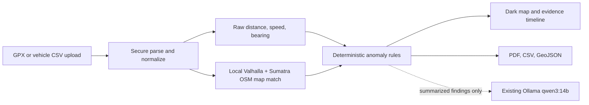

# GPX Inspector

GPX Inspector is a dark-themed local web application for inspecting GPX tracks and Indonesian vehicle-history CSV exports against OpenStreetMap-derived road data. It calculates raw track metrics, requests map matching from Valhalla, flags deterministic anomalies, and exports PDF, CSV, and GeoJSON reports.


## Start

Requirements: Docker Desktop with Compose and, for optional explanations, an already installed Ollama containing `qwen3:14b`.

```powershell
docker compose up --build
```

All services use Docker's `unless-stopped` restart policy. They restart after a
container failure or Docker Desktop restart, unless you explicitly stop them.
Enable **Start Docker Desktop when you sign in** in Docker Desktop settings if
the stack should return automatically after rebooting Windows.

Open <http://localhost:3010>. The API documentation is at <http://localhost:8010/docs>, and the local Valhalla status endpoint is at <http://localhost:8020/status>.

On its first start, the `valhalla` service downloads Geofabrik's Sumatra OSM PBF and builds a local routing graph. The source download is roughly 269 MB and graph generation can take significant time depending on CPU and disk speed. Both are retained in the `gpx-valhalla` Docker volume and reused after restarts. Follow progress with `docker compose logs -f valhalla`.

No `.env` file is required. Copy `.env.example` to `.env` only to override defaults. The app never installs Ollama or downloads a model. From Docker it connects to the host service at `http://host.docker.internal:11434/v1` and enables explanations only when the exact `qwen3:14b` tag is returned by `/v1/models`.

## Analysis pipeline



Current detectors cover implausible speed, sudden acceleration/braking, heading changes, mapped speed-limit exceedance, and sustained road offset when provider attribution is available. Sparse multi-minute direction reversals are marked low-confidence for route review, and off-road findings require consecutive moving points beyond a conservative offset threshold. The API data model also preserves evidence and confidence for extending wrong-way, mode-access, stop, and detour rules. Results are analytical indicators, not legal proof.

The blue map overlay uses only recorded observations moved to their nearest mapped-road positions, split at sampling gaps longer than 15 minutes. It does not generate or claim a route between missing samples.
Recorded observations are shown as cyan points, with direction arrows between consecutive samples. Arrows are omitted across gaps longer than 15 minutes so missing data is not presented as known movement.

## Privacy and external services

Uploaded files, results, and local routing data persist in Docker volumes until deleted. Coordinates remain local when using the default Valhalla container; `VALHALLA_URL` can override it with another service. The background visual map still uses the configurable OpenFreeMap dark style with visible provider attribution. Qwen receives aggregate metrics and finding summaries, not raw point arrays.

## Demo data and exports

The sample catalog endpoint (`/api/sample-packs`) includes Jakarta, Bogor, Depok, Tangerang, and Bekasi GPX downloads. Reports are available from each completed trip as PDF, CSV, and GeoJSON.

## Development checks

```powershell
cd backend
python -m pip install -e ".[test]"
pytest

cd ../frontend
npm install
npm run build
```
